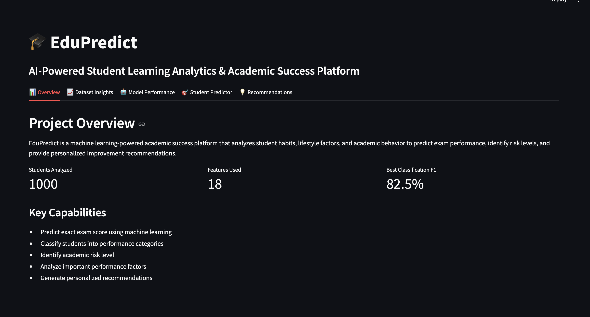
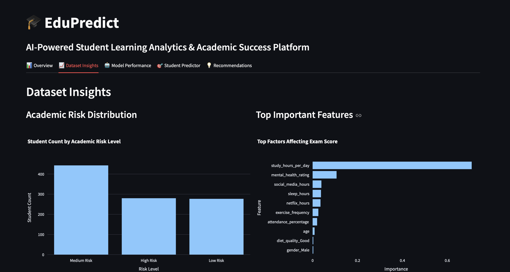
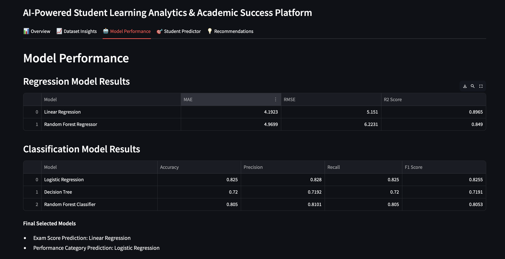
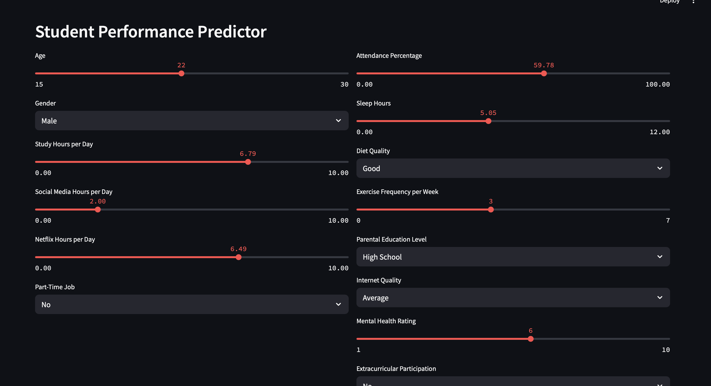
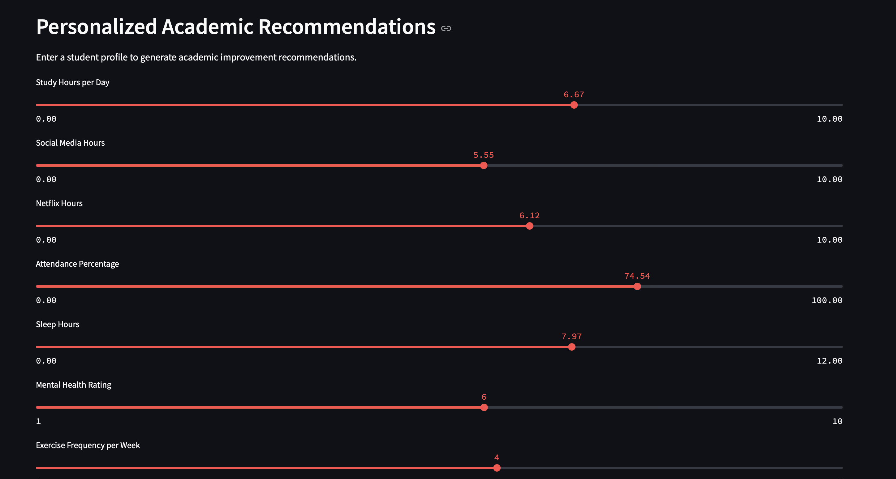

# 🎓 EduPredict: AI-Powered Student Learning Analytics & Academic Success Platform

## Live Demo

🚀 Try EduPredict here:  
https://edupredict-amgsk8umegcfe6k3kjjxhh.streamlit.app

## 📌 Project Overview

EduPredict is a Machine Learning-powered educational analytics platform designed to analyze student habits, lifestyle factors, and academic behaviors to predict academic performance, identify at-risk students, and generate personalized improvement recommendations.

The project combines data analysis, predictive modeling, academic risk assessment, and interactive visualization to help students better understand the factors that influence academic success.

By leveraging Machine Learning techniques, EduPredict provides actionable insights that can support students, educators, and academic institutions in improving learning outcomes.

---

# 🎯 Problem Statement

Student academic performance is influenced by multiple factors beyond classroom learning, including study habits, sleep patterns, mental health, social media usage, attendance, exercise frequency, and lifestyle choices.

Many students struggle to identify which factors are negatively affecting their performance, while educators often lack data-driven tools to proactively identify at-risk students.

EduPredict addresses this challenge by:

* Predicting student exam performance
* Classifying performance levels
* Assessing academic risk
* Providing personalized recommendations for improvement

---

# 📊 Dataset

### https://www.kaggle.com/datasets/jayaantanaath/student-habits-vs-academic-performance

Student Habits vs Academic Performance

### Dataset Size

* 1,000 student records
* 16 original features

### Key Features

* Age
* Gender
* Study Hours Per Day
* Social Media Hours
* Netflix Hours
* Attendance Percentage
* Sleep Hours
* Diet Quality
* Exercise Frequency
* Mental Health Rating
* Internet Quality
* Parental Education Level
* Extracurricular Participation
* Exam Score

### Target Variables

#### Regression Target

* Exam Score

#### Classification Target

* Performance Category

  * Low Performer
  * Average Performer
  * High Performer

---

# 🔄 Project Workflow

### Notebook 01 – Data Understanding

* Dataset exploration
* Data types inspection
* Missing value analysis
* Descriptive statistics

### Notebook 02 – Data Cleaning

* Missing value handling
* Data consistency checks
* Data preparation

### Notebook 03 – Exploratory Data Analysis

* Correlation analysis
* Distribution analysis
* Behavioral pattern discovery
* Academic performance insights

### Notebook 04 – Feature Engineering & Preprocessing

* One-hot encoding
* Feature transformation
* Classification target creation
* Dataset preparation for ML models

### Notebook 05 – Machine Learning Modeling

* Regression modeling
* Classification modeling
* Model comparison

### Notebook 06 – Model Improvement & Feature Importance

* Hyperparameter tuning
* Cross-validation
* Feature importance analysis

### Notebook 07 – Academic Risk Assessment

* Student risk profiling
* Risk categorization
* Recommendation generation

### Notebook 08 – Model Serialization

* Saving final models
* Exporting feature columns
* Deployment preparation

---

# 🤖 Machine Learning Models

## Regression Models

### Linear Regression

Used for predicting exact exam scores.

Performance:

* MAE: 4.19
* RMSE: 5.15
* R² Score: 0.897

### Random Forest Regressor

Used for performance comparison and feature importance analysis.

Performance:

* MAE: 4.97
* RMSE: 6.22
* R² Score: 0.849

---

## Classification Models

### Logistic Regression

Performance:

* Accuracy: 82.5%
* Precision: 82.8%
* Recall: 82.5%
* F1 Score: 82.5%

### Decision Tree Classifier

Performance:

* Accuracy: 72.0%
* F1 Score: 71.9%

### Random Forest Classifier

Performance:

* Accuracy: 80.5%
* F1 Score: 80.5%

---

# 📈 Cross Validation Results

### Logistic Regression

* Mean F1 Score: 0.839
* Standard Deviation: 0.019

### Random Forest Classifier

* Mean F1 Score: 0.781
* Standard Deviation: 0.030

### Decision Tree Classifier

* Mean F1 Score: 0.694
* Standard Deviation: 0.017

---

# 🔍 Key Findings

### Most Important Factors Affecting Academic Performance

| Feature              | Importance |
| -------------------- | ---------- |
| Study Hours Per Day  | 70.8%      |
| Mental Health Rating | 10.7%      |
| Social Media Hours   | 3.9%       |
| Sleep Hours          | 3.7%       |
| Netflix Hours        | 3.5%       |
| Exercise Frequency   | 2.6%       |

### Major Insights

* Study hours are the strongest predictor of academic success.
* Mental health significantly impacts academic outcomes.
* Excessive social media usage negatively affects exam scores.
* Better sleep habits contribute to improved performance.
* Students with higher attendance generally achieve better results.

---

# 🚨 Academic Risk Assessment System

EduPredict categorizes students into:

### Low Risk

Predicted Exam Score ≥ 80

### Medium Risk

Predicted Exam Score 60–79

### High Risk

Predicted Exam Score < 60

The system automatically identifies students who may require additional academic support.

---

# 💡 Personalized Recommendation Engine

The recommendation system analyzes student habits and generates customized suggestions such as:

* Increase study hours
* Reduce social media usage
* Improve sleep quality
* Increase physical activity
* Improve attendance
* Focus on mental well-being

---

# 🌐 Interactive Dashboard

Built using Streamlit.

Features:

* Dataset Insights Dashboard
* Feature Importance Visualization
* Academic Risk Analysis
* Exam Score Prediction
* Performance Classification
* Personalized Recommendations

---

# 🖼️ Screenshots

## Overview Dashboard



## Dataset Insights



## Model Performance



## Student Predictor



## Recommendations



---

# 🛠️ Technologies Used

### Programming Language

* Python

### Libraries

* Pandas
* NumPy
* Matplotlib
* Seaborn
* Plotly
* Scikit-learn
* Joblib

### Tools

* Jupyter Notebook
* Streamlit
* Git
* GitHub

---

# 🚀 How to Run

Clone the repository:

```bash
git clone https://github.com/thishan2004/EduPredict.git
```

Navigate to the project folder:

```bash
cd EduPredict
```

Install dependencies:

```bash
pip install -r requirements.txt
```

Run the application:

```bash
streamlit run app/app.py
```

---

# 🔮 Future Improvements

* Deep Learning-based prediction models
* Real student institutional datasets
* Student performance tracking over time
* Early warning intervention system
* Teacher analytics dashboard
* Automated academic improvement plans

---

# 👨‍💻 Author

Thishanujan Kugathasan

BSc (Hons) Information Technology – Data Science Specialization

Sri Lanka Institute of Information Technology (SLIIT)

GitHub: https://github.com/thishan2004

Email: thishan2004@gmail.com

LinkedIn: https://www.linkedin.com/in/thishanujan-kugathasan-7282b9311/
